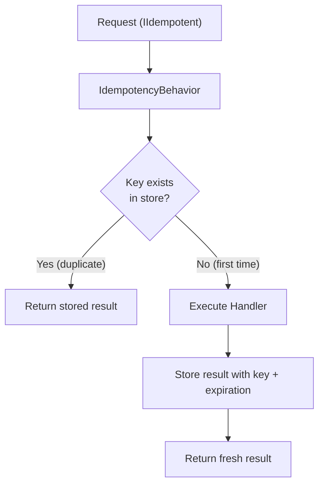

# Idempotency

`Vali-Mediator.Idempotency` prevents duplicate processing of requests by storing results and returning cached outcomes for repeated requests with the same idempotency key.

## Installation

```bash
dotnet add package Vali-Mediator.Idempotency
```

## Setup

```csharp
builder.Services.AddValiMediator(config =>
{
    config.RegisterServicesFromAssemblyContaining<Program>();
    config.AddIdempotencyBehavior();
});

builder.Services.AddInMemoryIdempotencyStore();
```

## How It Works



## Marking a Request as Idempotent

```csharp
public record ProcessPaymentCommand(
    Guid OrderId,
    decimal Amount,
    string CardToken) : IRequest<Result<string>>, IIdempotent
{
    // Unique key for this specific payment attempt
    public string IdempotencyKey => $"payment:{OrderId}";

    // How long to remember this result
    public TimeSpan Expiration => TimeSpan.FromHours(24);
}
```

## Use Cases

### Payment Processing

```csharp
// Client sends payment request with a client-generated idempotency key
public record ProcessPaymentCommand(string IdempotencyKey, decimal Amount, string Token)
    : IRequest<Result<PaymentDto>>, IIdempotent
{
    string IIdempotent.IdempotencyKey => IdempotencyKey;
    public TimeSpan Expiration => TimeSpan.FromHours(24);
}
```

### Order Creation

```csharp
public record CreateOrderCommand(string ClientRequestId, List<OrderItem> Items)
    : IRequest<Result<Guid>>, IIdempotent
{
    public string IdempotencyKey => $"create-order:{ClientRequestId}";
    public TimeSpan Expiration => TimeSpan.FromMinutes(30);
}
```

## Client Pattern

The API client sends a unique idempotency key in the request:

```csharp
// HTTP API endpoint
app.MapPost("/payments", async (
    [FromHeader(Name = "Idempotency-Key")] string idempotencyKey,
    PaymentRequest body,
    IValiMediator mediator) =>
{
    var command = new ProcessPaymentCommand(
        IdempotencyKey: idempotencyKey,
        Amount: body.Amount,
        Token: body.CardToken);

    Result<PaymentDto> result = await mediator.Send(command);
    return result.ToHttpResult();
});
```

:::tip
Use UUIDs as idempotency keys and let clients generate them. This allows clients to safely retry failed requests without risk of double-processing.
:::

## Serialization

Results are serialized using `IIdempotencySerializer` (default: `JsonIdempotencySerializer` using `System.Text.Json`). The serialized bytes are stored in the idempotency store.
