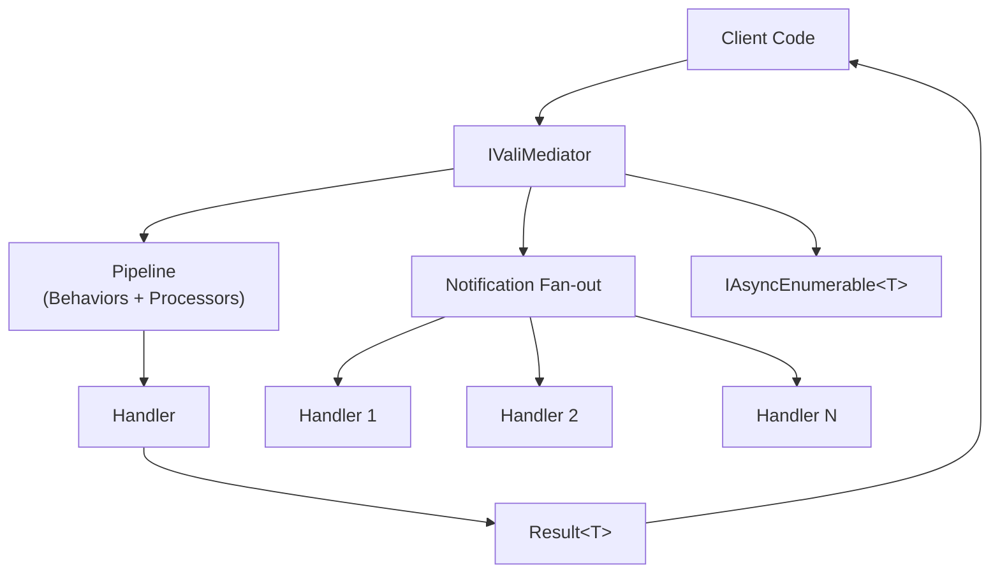

# Vali-Mediator

**Vali-Mediator** is a lightweight .NET library that implements the **Mediator pattern** with full CQRS support. It provides a clean separation between request senders and request handlers, a powerful pipeline for cross-cutting concerns, and a rich ecosystem of extension packages.

## Why Vali-Mediator?

- **Zero external dependencies** in the core package (only `Microsoft.Extensions.DependencyInjection.Abstractions`)
- **Targets .NET 7, 8, and 9** — multi-target from one package
- **Result pattern built-in** — no exceptions for business logic failures
- **Extensible pipeline** — add behaviors, pre/post processors without touching business code
- **Complete ecosystem** — resilience, caching, observability, and idempotency as optional packages

## Dispatch Flow

## Package Ecosystem

| Package | NuGet | Description |
|---------|-------|-------------|
| `Vali-Mediator` |  | Core: mediator, pipeline, result pattern |
| `Vali-Mediator.AspNetCore` |  | Maps `Result<T>` to HTTP responses |
| `Vali-Mediator.Resilience` |  | Retry, Circuit Breaker, Timeout, Bulkhead, Hedge, Rate Limiter, Chaos, Fallback |
| `Vali-Mediator.Caching` |  | Declarative pipeline caching |
| `Vali-Mediator.Observability` |  | OpenTelemetry tracing, metrics, observers |
| `Vali-Mediator.Idempotency` |  | Idempotent request deduplication |

## Key Features

### Requests & CQRS
- `IRequest<TResponse>` + `IRequestHandler<TRequest, TResponse>`
- Void shorthand: `IRequest` → `IRequest<Unit>`
- `SendOrDefault` — returns `default` when no handler registered
- `SendAll` — parallel execution via `Task.WhenAll`

### Notifications
- Fan-out to N handlers via `INotification`
- Priority-ordered execution
- `PublishStrategy`: Sequential, Parallel, or ResilientParallel
- `INotificationFilter<T>` — conditionally skip handlers

### Pipeline
- `IPipelineBehavior<TRequest, TResponse>` for requests
- `IPipelineBehavior<TDispatch>` for notifications/fire-and-forget
- Auto-discovered pre/post processors
- Declarative timeout via `IHasTimeout`
- Dead letter queue for failed notifications

### Result Pattern
- `Result<T>` and `Result` (void) — readonly structs
- `ErrorType` enum maps to HTTP status codes
- Functional operations: `Map`, `Bind`, `Tap`, `Match`, `OnFailure`

### Streaming
- `IStreamRequest<T>` + `CreateStream()` → `IAsyncEnumerable<T>`

## Version

Current stable version: **2.0.0**
