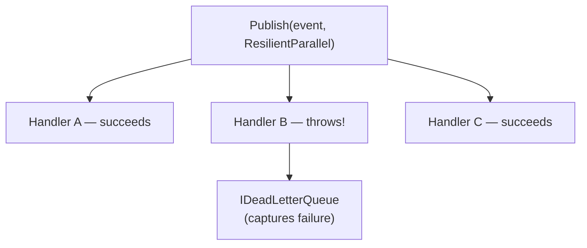

# Dead Letter Queue

The Dead Letter Queue (DLQ) captures notification handler failures when using `PublishStrategy.ResilientParallel`, allowing you to inspect, retry, or alert on failures without losing them.

## Setup

```csharp
// Program.cs
builder.Services.AddInMemoryDeadLetterQueue();
```

## How It Works

When using `ResilientParallel`, all handlers run regardless of individual failures. Any handler that throws is captured in the DLQ instead of propagating the exception:



## Publishing with ResilientParallel

```csharp
await _mediator.Publish(
    new OrderPlacedEvent(orderId, customerId),
    PublishStrategy.ResilientParallel);
```

## Inspecting the DLQ

```csharp
public class DlqMonitoringService
{
    private readonly InMemoryDeadLetterQueue _dlq;

    public DlqMonitoringService(IDeadLetterQueue dlq)
    {
        // Cast to access GetEntries()
        _dlq = (InMemoryDeadLetterQueue)dlq;
    }

    public void PrintFailures()
    {
        IReadOnlyList<DeadLetterEntry> entries = _dlq.GetEntries();

        foreach (var entry in entries)
        {
            Console.WriteLine($"Handler: {entry.HandlerType.Name}");
            Console.WriteLine($"Event: {entry.Notification.GetType().Name}");
            Console.WriteLine($"Error: {entry.Exception.Message}");
            Console.WriteLine($"Time: {entry.Timestamp}");
        }
    }
}
```

## DeadLetterEntry Structure

```csharp
public class DeadLetterEntry
{
    public Type HandlerType { get; }
    public INotification Notification { get; }
    public Exception Exception { get; }
    public DateTimeOffset Timestamp { get; }
}
```

## DLQ Endpoint (API)

Expose the DLQ via an endpoint for monitoring:

```csharp
app.MapGet("/admin/dlq", (IDeadLetterQueue dlq) =>
{
    var entries = ((InMemoryDeadLetterQueue)dlq).GetEntries();
    return Results.Ok(entries.Select(e => new
    {
        handler = e.HandlerType.Name,
        notification = e.Notification.GetType().Name,
        error = e.Exception.Message,
        timestamp = e.Timestamp
    }));
});
```

## Custom DLQ Implementation

For production, implement `IDeadLetterQueue` to persist failures to a database or message queue:

```csharp
public class SqlDeadLetterQueue : IDeadLetterQueue
{
    private readonly AppDbContext _db;

    public SqlDeadLetterQueue(AppDbContext db)
    {
        _db = db;
    }

    public async Task EnqueueAsync(
        Type handlerType,
        INotification notification,
        Exception exception,
        CancellationToken ct)
    {
        _db.DeadLetterEntries.Add(new DeadLetterRecord
        {
            HandlerType = handlerType.FullName!,
            NotificationType = notification.GetType().FullName!,
            NotificationJson = JsonSerializer.Serialize(notification, notification.GetType()),
            ErrorMessage = exception.Message,
            StackTrace = exception.StackTrace,
            OccurredAt = DateTimeOffset.UtcNow
        });
        await _db.SaveChangesAsync(ct);
    }
}

// Register
builder.Services.AddScoped<IDeadLetterQueue, SqlDeadLetterQueue>();
```

:::tip
Use a custom DLQ backed by a persistent store in production so failures survive application restarts and can be replayed.
:::
