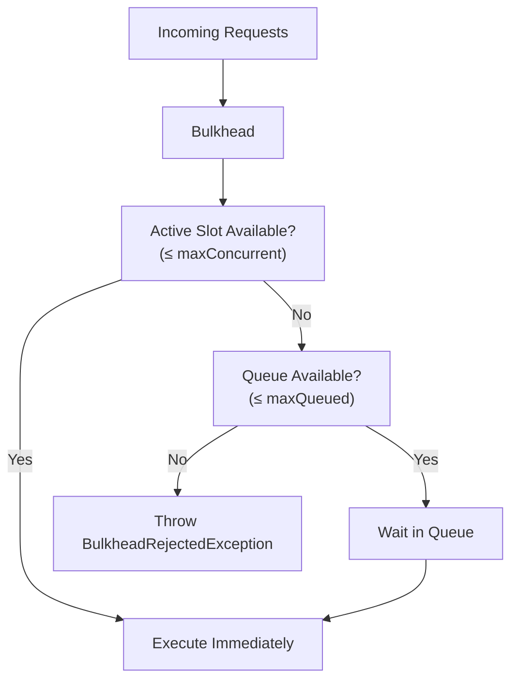

# Bulkhead (Concurrency Limit)

The bulkhead policy limits the number of concurrent executions and optionally queues excess requests. It prevents a single dependency from consuming all available resources.

## Basic Usage

```csharp
var policy = ResiliencePolicy.Create()
    .Bulkhead(maxConcurrent: 10, maxQueued: 20)
    .Build();
```

## How It Works



## Configuration Options

```csharp
var policy = ResiliencePolicy.Create()
    .Bulkhead(opts =>
    {
        opts.MaxConcurrency = 10;           // max parallel executions
        opts.MaxQueueSize = 50;             // max queued requests
        opts.QueueTimeout = TimeSpan.FromSeconds(5); // how long to wait in queue
        opts.OnRejected = context =>
        {
            _logger.LogWarning("Bulkhead rejected request — system at capacity");
            return Task.CompletedTask;
        };
    })
    .Build();
```

## Handling Rejection

When the bulkhead is full and the queue is also full, it throws `BulkheadRejectedException`:

```csharp
try
{
    var result = await policy.ExecuteAsync<string>(async ct =>
    {
        return await _expensiveOperation.RunAsync(ct);
    });
}
catch (BulkheadRejectedException ex)
{
    // Return a 429 or queue to a background job
    return Results.StatusCode(429);
}
```

## Use Cases

### Protecting a Downstream Service

```csharp
// Limit calls to the payment service to 5 concurrent
var paymentPolicy = ResiliencePolicy.Create()
    .Bulkhead(maxConcurrent: 5, maxQueued: 10)
    .Timeout(TimeSpan.FromSeconds(30))
    .Build();
```

### Database Connection Pool

```csharp
// Don't exceed the database connection pool size
var dbPolicy = ResiliencePolicy.Create()
    .Bulkhead(opts =>
    {
        opts.MaxConcurrency = 20; // match your connection pool size
        opts.MaxQueueSize = 100;
        opts.QueueTimeout = TimeSpan.FromSeconds(10);
    })
    .Build();
```

:::tip
Combine bulkhead with circuit breaker for comprehensive protection: bulkhead limits concurrency, circuit breaker stops calls when the failure rate is high.
:::
