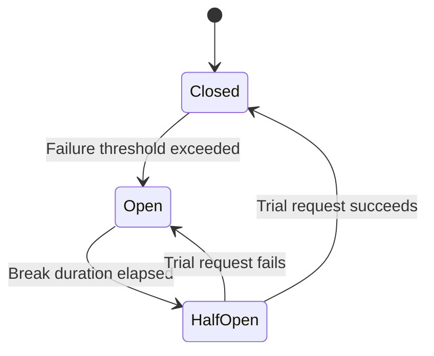

# Circuit Breaker

The circuit breaker prevents calling a failing service repeatedly. After a threshold of failures, it "opens" the circuit and fast-fails requests until the service has time to recover.

## State Machine



## Basic Usage

```csharp
var policy = ResiliencePolicy.Create()
    .CircuitBreaker(opts =>
    {
        opts.FailureThreshold = 5;           // open after 5 failures
        opts.MinimumThroughput = 10;         // need at least 10 calls in window
        opts.SamplingDurationMs = 30_000;    // sliding window: 30 seconds
        opts.BreakDuration = TimeSpan.FromSeconds(60); // stay open for 60s
    })
    .Build();
```

## Shared Circuit State

Use `CircuitKey` to share circuit breaker state across multiple policy instances (e.g., all requests to the same downstream service):

```csharp
// All handlers that call the inventory service share one circuit
var inventoryPolicy = ResiliencePolicy.Create()
    .CircuitBreaker(opts =>
    {
        opts.CircuitKey = "inventory-service"; // shared key
        opts.FailureThreshold = 10;
        opts.BreakDuration = TimeSpan.FromSeconds(30);
    })
    .Build();
```

## Callbacks

```csharp
.CircuitBreaker(opts =>
{
    opts.FailureThreshold = 5;
    opts.BreakDuration = TimeSpan.FromSeconds(30);

    opts.OnBreak = context =>
    {
        _logger.LogWarning(
            "Circuit OPEN for {Duration}s after {Error}",
            30, context.Exception?.Message);
        return Task.CompletedTask;
    };

    opts.OnReset = () =>
    {
        _logger.LogInformation("Circuit CLOSED — service recovered");
        return Task.CompletedTask;
    };

    opts.OnHalfOpen = () =>
    {
        _logger.LogInformation("Circuit HALF-OPEN — testing service...");
        return Task.CompletedTask;
    };
})
```

## Monitoring Circuit State

Use `ICircuitBreakerRegistry` to inspect the current state:

```csharp
public class CircuitBreakerHealthCheck : IHealthCheck
{
    private readonly ICircuitBreakerRegistry _registry;

    public CircuitBreakerHealthCheck(ICircuitBreakerRegistry registry)
    {
        _registry = registry;
    }

    public Task<HealthCheckResult> CheckHealthAsync(
        HealthCheckContext context,
        CancellationToken ct)
    {
        var state = _registry.GetState("inventory-service");

        if (state?.IsOpen == true)
        {
            return Task.FromResult(HealthCheckResult.Degraded(
                "Inventory service circuit is open"));
        }

        return Task.FromResult(HealthCheckResult.Healthy());
    }
}
```

## Full Example

```csharp
var policy = ResiliencePolicy.Create()
    .Retry(opts =>
    {
        opts.MaxRetries = 2;
        opts.BackoffType = BackoffType.Exponential;
    })
    .CircuitBreaker(opts =>
    {
        opts.CircuitKey = "payment-service";
        opts.FailureThreshold = 5;
        opts.MinimumThroughput = 3;
        opts.SamplingDurationMs = 60_000;
        opts.BreakDuration = TimeSpan.FromSeconds(30);
        opts.OnBreak = ctx =>
        {
            _alerts.SendCircuitOpenAlert("payment-service");
            return Task.CompletedTask;
        };
    })
    .Build();
```

:::warning
When the circuit is **Open**, calls throw `CircuitBreakerOpenException` immediately without executing the operation. Combine with a **Fallback** policy to handle this gracefully.
:::
