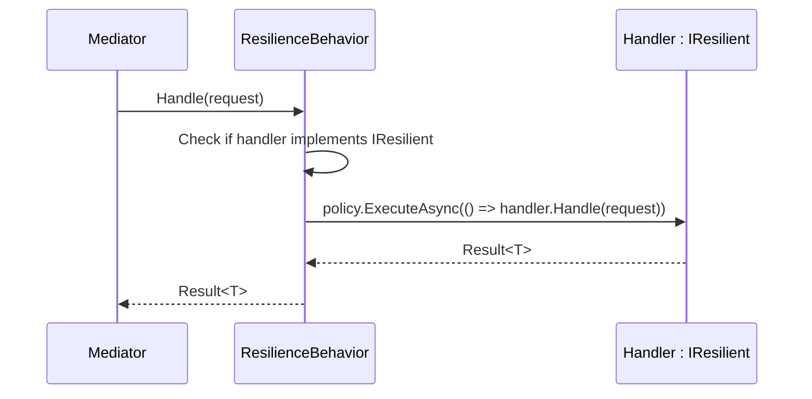

# Handler Integration

Instead of creating and managing policies manually, you can declare a resilience policy directly on a handler class using the `IResilient` interface.

## IResilient

```csharp
public interface IResilient
{
    ResiliencePolicy ResiliencePolicy { get; }
}
```

## Implementation

```csharp
public class GetProductHandler
    : IRequestHandler<GetProductQuery, Result<ProductDto>>,
      IResilient
{
    private static readonly ResiliencePolicy Policy = ResiliencePolicy.Create()
        .Retry(opts =>
        {
            opts.MaxRetries = 3;
            opts.BackoffType = BackoffType.Exponential;
            opts.DelayMs = 200;
        })
        .CircuitBreaker(opts =>
        {
            opts.CircuitKey = "product-db";
            opts.FailureThreshold = 5;
            opts.BreakDuration = TimeSpan.FromSeconds(30);
        })
        .Timeout(TimeSpan.FromSeconds(5))
        .Build();

    // IResilient implementation
    public ResiliencePolicy ResiliencePolicy => Policy;

    private readonly IProductRepository _repository;

    public GetProductHandler(IProductRepository repository)
    {
        _repository = repository;
    }

    public async Task<Result<ProductDto>> Handle(
        GetProductQuery request,
        CancellationToken ct)
    {
        var product = await _repository.GetByIdAsync(request.ProductId, ct);

        if (product is null)
            return Result<ProductDto>.Fail("Product not found.", ErrorType.NotFound);

        return Result<ProductDto>.Ok(product.ToDto());
    }
}
```

:::note
Declare the policy as `static readonly` to avoid recreating it on every handler instantiation. The policy maintains internal state (circuit breaker, rate limiter) that must persist across calls.
:::

## Registration

Register the `ResilienceBehavior` in your DI setup:

```csharp
builder.Services.AddValiMediator(config =>
{
    config.RegisterServicesFromAssemblyContaining<Program>();

    // Enable resilience behavior — auto-applied to handlers implementing IResilient
    config.AddResilienceBehavior();
});
```

## How It Works

`ResilienceBehavior<TRequest, TResponse>` intercepts every request. If the handler implements `IResilient`, it wraps the handler execution with the policy:



## Per-Handler Policies

Each handler can have its own policy tuned for its specific needs:

```csharp
// Fast reads — use hedge for low latency
public class GetProductHandler : IRequestHandler<GetProductQuery, Result<ProductDto>>, IResilient
{
    public ResiliencePolicy ResiliencePolicy { get; } = ResiliencePolicy.Create()
        .Hedge(TimeSpan.FromMilliseconds(50))
        .Timeout(TimeSpan.FromSeconds(1))
        .Build();
}

// Payment — use retry + circuit breaker
public class ProcessPaymentHandler : IRequestHandler<ProcessPaymentCommand, Result<string>>, IResilient
{
    public ResiliencePolicy ResiliencePolicy { get; } = ResiliencePolicy.Create()
        .Fallback<Result<string>>(opts =>
        {
            opts.FallbackValue = Result<string>.Fail("Payment unavailable", ErrorType.Failure);
        })
        .Retry(2)
        .CircuitBreaker(opts =>
        {
            opts.CircuitKey = "payment-gateway";
            opts.FailureThreshold = 3;
            opts.BreakDuration = TimeSpan.FromMinutes(1);
        })
        .Timeout(TimeSpan.FromSeconds(30))
        .Build();
}
```
