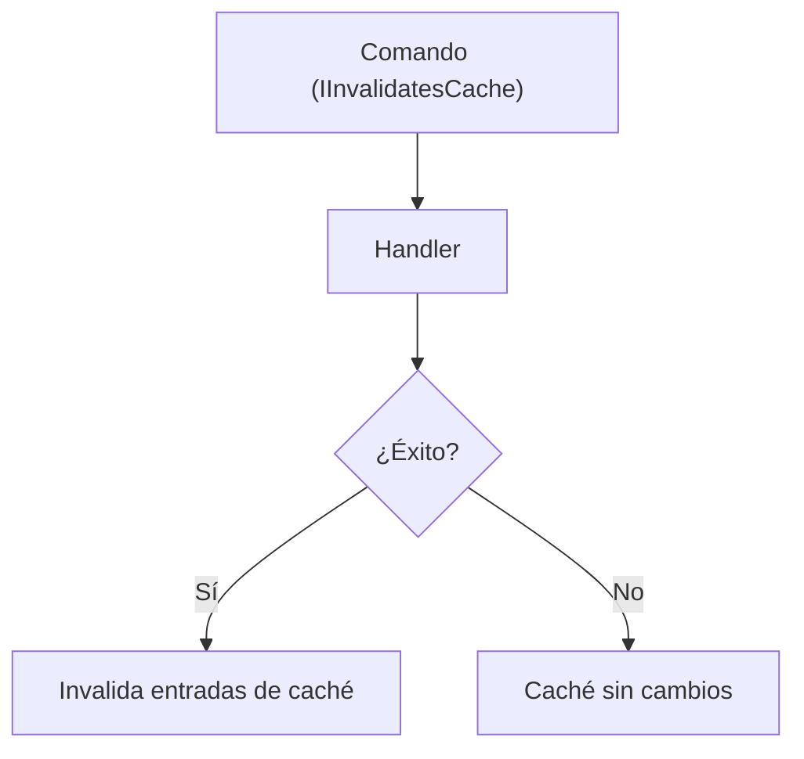

# Invalidación de Caché

Usa `IInvalidatesCache` en cualquier solicitud para invalidar automáticamente entradas de caché cuando la solicitud se procesa.

## Invalidación por Clave

```csharp
public record UpdateProductCommand(Guid Id, string Name, decimal Price)
    : IRequest<Result>, IInvalidatesCache
{
    // Invalida la entrada cacheada del producto específico
    public IEnumerable<string> InvalidatedKeys => new[] { $"product:{Id}" };
    public IEnumerable<string> InvalidatedGroups => Enumerable.Empty<string>();
}
```

## Invalidación por Grupo

```csharp
public record CreateProductCommand(string Name, decimal Price, string Category)
    : IRequest<Result<Guid>>, IInvalidatesCache
{
    // Un nuevo producto significa que todas las páginas de listas de productos están obsoletas
    public IEnumerable<string> InvalidatedKeys => Enumerable.Empty<string>();
    public IEnumerable<string> InvalidatedGroups => new[] { "products" };
}
```

## Invalidación Combinada

```csharp
public record DeleteProductCommand(Guid Id)
    : IRequest<Result>, IInvalidatesCache
{
    public IEnumerable<string> InvalidatedKeys => new[]
    {
        $"product:{Id}",
        $"product-details:{Id}",
    };

    public IEnumerable<string> InvalidatedGroups => new[]
    {
        "products",
        "featured-products",
    };
}
```

## Temporalidad de la Invalidación

La invalidación de caché se ejecuta **después** de que el handler ejecute exitosamente. Si el handler falla, la caché NO se invalida.



## Patrón Write-Through Completo

```csharp
// Consulta — cacheada
public record GetProductQuery(Guid Id) : IRequest<Result<ProductDto>>, ICacheable
{
    public string CacheKey => $"product:{Id}";
    public TimeSpan? AbsoluteExpiration => TimeSpan.FromMinutes(30);
    public TimeSpan? SlidingExpiration => null;
    public string? CacheGroup => "products";
    public bool BypassCache => false;
    public CacheOrder Order => CacheOrder.CheckThenStore;
}

// Comando — invalida
public record UpdateProductCommand(Guid Id, string Name, decimal Price)
    : IRequest<Result>, IInvalidatesCache
{
    public IEnumerable<string> InvalidatedKeys => new[] { $"product:{Id}" };
    public IEnumerable<string> InvalidatedGroups => new[] { "products" };
}
```

:::tip Convención de Nomenclatura de Claves
Usa un formato de clave consistente entre consultas y comandos de invalidación. Un buen patrón es `tipo-entidad:id` (ej. `product:42`, `user:profile:100`).
:::
