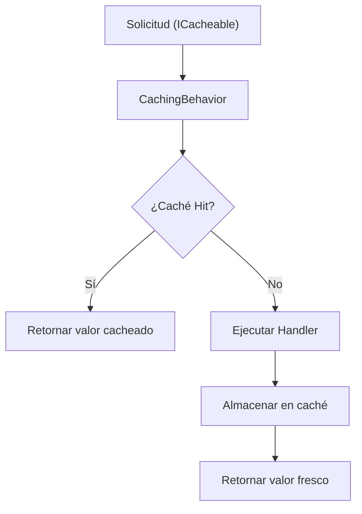

# Caché

`Vali-Mediator.Caching` agrega caché declarativa en el pipeline a cualquier `IRequest<T>` sin modificar el código del handler.

## Instalación

```bash
dotnet add package Vali-Mediator.Caching
```

## Configuración

```csharp
builder.Services.AddValiMediator(config =>
{
    config.RegisterServicesFromAssemblyContaining<Program>();
    config.AddCachingBehavior();
});

builder.Services.AddInMemoryCacheStore();
```

## Cómo Funciona



## Ejemplo Rápido

```csharp
public record GetProductQuery(Guid Id)
    : IRequest<Result<ProductDto>>, ICacheable
{
    public string CacheKey => $"product:{Id}";
    public TimeSpan? AbsoluteExpiration => TimeSpan.FromMinutes(10);
    public TimeSpan? SlidingExpiration => null;
    public string? CacheGroup => "products";
    public bool BypassCache => false;
    public CacheOrder Order => CacheOrder.CheckThenStore;
}
```

El handler no necesita cambios — la caché se aplica transparentemente por el pipeline behavior.

## Conceptos Clave

| Concepto | Descripción |
|---------|-------------|
| `ICacheable` | Marca una solicitud como cacheable; provee clave de caché y expiración |
| `IInvalidatesCache` | Marca una solicitud que invalida entradas cacheadas |
| `ICacheStore` | Abstracción del backend de caché (en memoria, Redis, etc.) |
| `CacheOrder` | Controla check-then-store vs store-only vs check-only |
| `CacheGroup` | Agrupa entradas de caché relacionadas para invalidación masiva |
