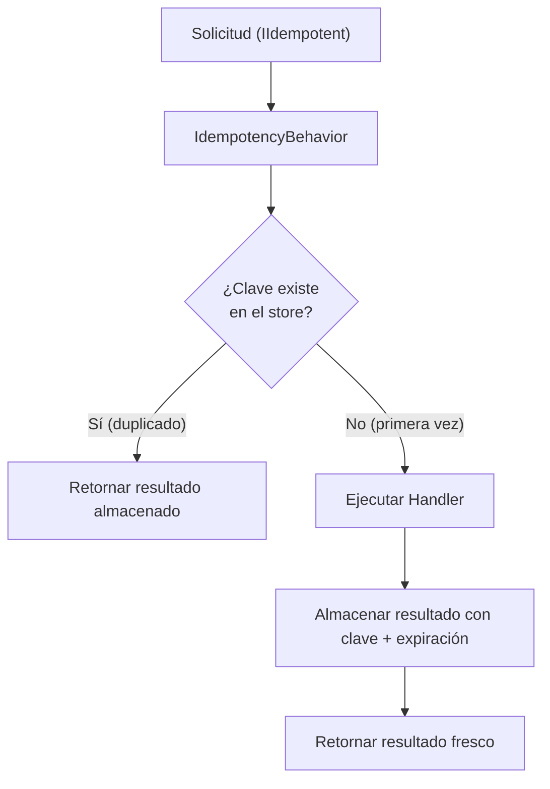

# Idempotencia

`Vali-Mediator.Idempotency` previene el procesamiento duplicado de solicitudes almacenando resultados y retornando resultados cacheados para solicitudes repetidas con la misma clave de idempotencia.

## Instalación

```bash
dotnet add package Vali-Mediator.Idempotency
```

## Configuración

```csharp
builder.Services.AddValiMediator(config =>
{
    config.RegisterServicesFromAssemblyContaining<Program>();
    config.AddIdempotencyBehavior();
});

builder.Services.AddInMemoryIdempotencyStore();
```

## Cómo Funciona



## Marcar una Solicitud como Idempotente

```csharp
public record ProcessPaymentCommand(
    Guid OrderId,
    decimal Amount,
    string CardToken) : IRequest<Result<string>>, IIdempotent
{
    // Clave única para este intento de pago específico
    public string IdempotencyKey => $"payment:{OrderId}";

    // Cuánto tiempo recordar este resultado
    public TimeSpan Expiration => TimeSpan.FromHours(24);
}
```

## Patrón de Uso con API HTTP

```csharp
app.MapPost("/payments", async (
    [FromHeader(Name = "Idempotency-Key")] string idempotencyKey,
    PaymentRequest body,
    IValiMediator mediator) =>
{
    var command = new ProcessPaymentCommand(
        IdempotencyKey: idempotencyKey,
        Amount: body.Amount,
        Token: body.CardToken);

    Result<PaymentDto> result = await mediator.Send(command);
    return result.ToHttpResult();
});
```

:::tip
Usa UUIDs como claves de idempotencia y deja que los clientes las generen. Esto permite a los clientes reintentar solicitudes fallidas de forma segura sin riesgo de procesamiento doble.
:::

## Serialización

Los resultados se serializan usando `IIdempotencySerializer` (por defecto: `JsonIdempotencySerializer` usando `System.Text.Json`). Los bytes serializados se almacenan en el store de idempotencia.
