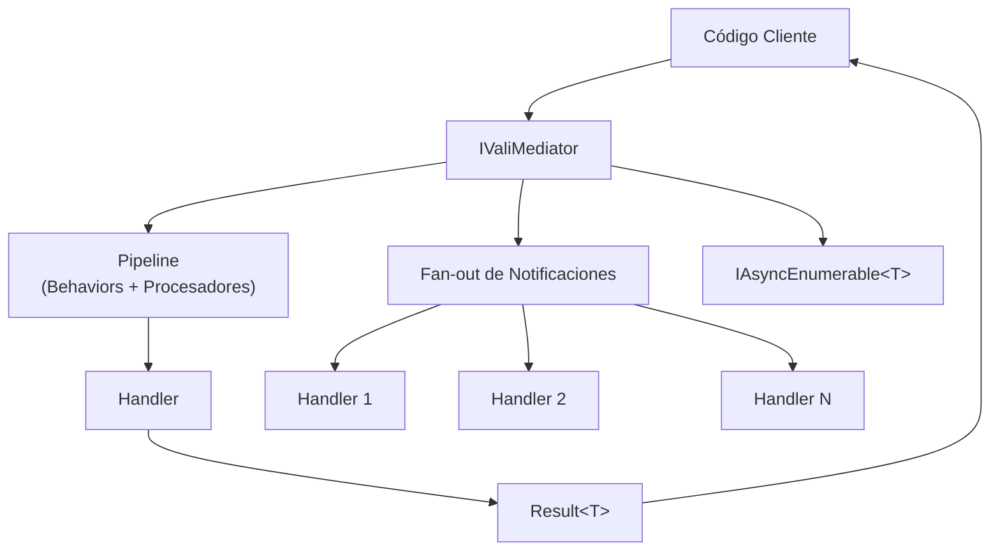

# Vali-Mediator

**Vali-Mediator** es una librería .NET ligera que implementa el **patrón Mediador** con soporte completo de CQRS. Proporciona una separación limpia entre quienes envían solicitudes y quienes las manejan, un pipeline poderoso para preocupaciones transversales y un rico ecosistema de paquetes de extensión.

## ¿Por qué Vali-Mediator?

- **Sin dependencias externas** en el paquete core (solo `Microsoft.Extensions.DependencyInjection.Abstractions`)
- **Soporta .NET 7, 8 y 9** — multi-target desde un solo paquete
- **Patrón Result integrado** — sin excepciones para fallos de lógica de negocio
- **Pipeline extensible** — agrega behaviors y pre/post procesadores sin tocar el código de negocio
- **Ecosistema completo** — resiliencia, caché, observabilidad e idempotencia como paquetes opcionales

## Flujo de Despacho

## Ecosistema de Paquetes

| Paquete | Descripción |
|---------|-------------|
| `Vali-Mediator` | Core: mediador, pipeline, patrón result |
| `Vali-Mediator.AspNetCore` | Mapea `Result<T>` a respuestas HTTP |
| `Vali-Mediator.Resilience` | Retry, Circuit Breaker, Timeout, Bulkhead, Hedge, Rate Limiter, Chaos, Fallback |
| `Vali-Mediator.Caching` | Caché declarativa en el pipeline |
| `Vali-Mediator.Observability` | Trazado OpenTelemetry, métricas, observadores |
| `Vali-Mediator.Idempotency` | Deduplicación de solicitudes idempotentes |

## Características Principales

### Solicitudes y CQRS
- `IRequest<TResponse>` + `IRequestHandler<TRequest, TResponse>`
- Atajo void: `IRequest` → `IRequest<Unit>`
- `SendOrDefault` — retorna `default` si no hay handler registrado
- `SendAll` — ejecución paralela vía `Task.WhenAll`

### Notificaciones
- Fan-out a N handlers vía `INotification`
- Ejecución ordenada por prioridad
- `PublishStrategy`: Secuencial, Paralelo o ResilientParallel
- `INotificationFilter<T>` — omitir handlers condicionalmente

### Pipeline
- `IPipelineBehavior<TRequest, TResponse>` para solicitudes
- `IPipelineBehavior<TDispatch>` para notificaciones/fire-and-forget
- Pre/post procesadores descubiertos automáticamente
- Timeout declarativo vía `IHasTimeout`
- Cola de mensajes muertos para notificaciones fallidas

### Patrón Result
- `Result<T>` y `Result` (void) — structs readonly
- Enum `ErrorType` mapea a códigos HTTP
- Operaciones funcionales: `Map`, `Bind`, `Tap`, `Match`, `OnFailure`

### Streaming
- `IStreamRequest<T>` + `CreateStream()` → `IAsyncEnumerable<T>`

## Versión

Versión estable actual: **2.0.0**
