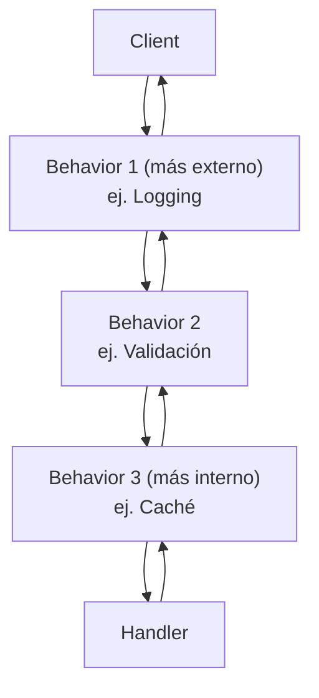

# Behaviors del Pipeline

Los pipeline behaviors envuelven la ejecución del handler, habilitando preocupaciones transversales como logging, validación, caché y resiliencia — sin tocar el código del handler.

## El Modelo Cebolla



**Primero registrado = más externo** (ejecuta primero antes del handler, último después).

## Para Solicitudes

```csharp
public class LoggingBehavior<TRequest, TResponse>
    : IPipelineBehavior<TRequest, TResponse>
    where TRequest : IRequest<TResponse>
{
    private readonly ILogger<LoggingBehavior<TRequest, TResponse>> _logger;

    public LoggingBehavior(ILogger<LoggingBehavior<TRequest, TResponse>> logger)
    {
        _logger = logger;
    }

    public async Task<TResponse> Handle(
        TRequest request,
        Func<Task<TResponse>> next,
        CancellationToken cancellationToken)
    {
        _logger.LogInformation("Manejando {RequestType}", typeof(TRequest).Name);
        var response = await next();
        _logger.LogInformation("Manejado {RequestType}", typeof(TRequest).Name);
        return response;
    }
}
```

## Para Notificaciones y Fire-and-Forget

```csharp
public class NotificationLoggingBehavior<TNotification>
    : IPipelineBehavior<TNotification>
    where TNotification : INotification
{
    public async Task Handle(
        TNotification notification,
        Func<Task> next,
        CancellationToken cancellationToken)
    {
        Console.WriteLine($"[Notificación] Publicando {typeof(TNotification).Name}");
        await next();
        Console.WriteLine($"[Notificación] Publicado {typeof(TNotification).Name}");
    }
}
```

## Registro de Behaviors

```csharp
builder.Services.AddValiMediator(config =>
{
    config.RegisterServicesFromAssemblyContaining<Program>();

    // Genérico cerrado (tipo específico)
    config.AddRequestBehavior<LoggingBehavior<CreateOrderCommand, Result<string>>>();

    // Genérico abierto (aplica a todas las solicitudes)
    config.AddBehavior(
        typeof(IPipelineBehavior<,>),
        typeof(LoggingBehavior<,>));

    // Despacho (notificaciones/fire-and-forget)
    config.AddDispatchBehavior<NotificationLoggingBehavior<OrderPlacedEvent>>();
});
```

:::tip
Registra los behaviors en el orden en que quieres que envuelvan: **primero registrado = más externo**.
:::
